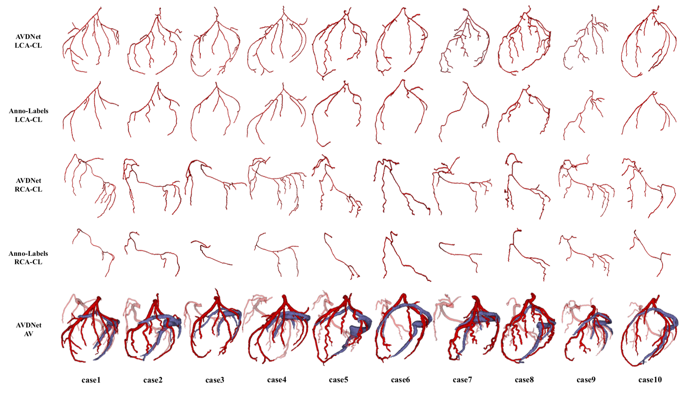

# Coronary-Artery-Vein-Segmentation
These are the official prediction results of the AVDNet on the ASOCA dataset for follow-up research.  
ASOCA: Automated Segmentation of Coronary Artery Challenge (The original data can be obtained from https://asoca.grand-challenge.org)  
*******************
The original paper **"AVDNet: Joint Coronary Artery and Vein Segmentation with Topological Consistency"** is the first study to segment coronary artery and vein vessels simultaneously from the CCTA images. Please check https://www.sciencedirect.com/science/article/abs/pii/S1361841523002591 for detailed ideas.  
  
*******************
In [AVDNet_ASOCA_pred](./AVDNet_ASOCA_pred), predictions of 40 training cases in ASOCA are produced by the AVDNet. There are more details of the arteries in the inference results from AVDNet than in the ASOCA annotations, and the veins are also provided.  
  
## Reference
If you find AVDNet and its predictions helpful, please consider citing the following paper:
